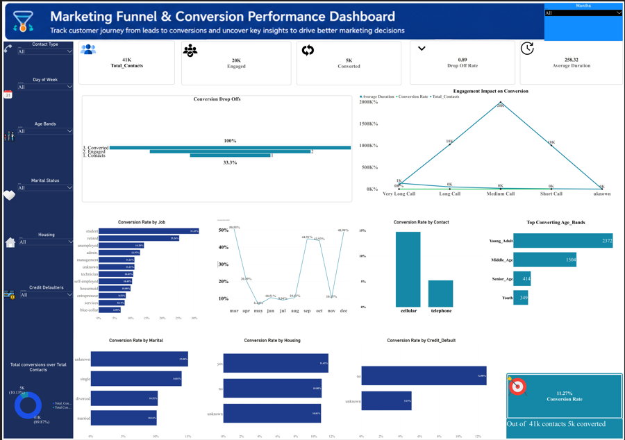

# FUTURE_DS_03
# 📊 Marketing Funnel & Conversion Performance Dashboard — Power BI


## 📌 Project Overview

This project is an interactive **Power BI dashboard** developed as part of a data analytics internship program. It analyzes a bank marketing campaign dataset to uncover conversion patterns, channel effectiveness, and customer segmentation insights across the marketing funnel.

The dashboard translates raw campaign data into clear, actionable insights to help marketing teams make smarter, data-driven decisions.

---

## 🔍 Key Insights

| # | Insight |
|---|---------|
| 1 | 👤 **Students and retirees** show the highest conversion rates among all customer segments |
| 2 | 📱 **Cellular campaigns** significantly outperform telephone outreach in driving conversions |
| 3 | 📅 **March, December, and September** delivered the strongest campaign performance across the year |
| 4 | 📉 The **largest customer drop-off** occurs between initial contact and meaningful engagement |
| 5 | ⏱️ **Longer customer conversations** strongly correlate with higher conversion rates |

---

## ✅ Recommendations

- **Prioritize cellular outreach channels** over traditional telephone campaigns
- **Increase engagement quality** during early customer interactions to reduce drop-off
- **Focus marketing efforts** on high-converting audience segments (students & retirees)
- **Expand campaigns** during high-performing months: March, December, and September
- **Reduce resources** allocated to low-performing contact strategies

---

## 🛠️ Tools & Technologies

- **Microsoft Power BI Desktop** — Dashboard design and data visualization
- **DAX (Data Analysis Expressions)** — Calculated measures and KPIs
- **Power Query** — Data cleaning and transformation
- **Dataset** — Bank marketing campaign data (telemarketing calls)

---

## 📁 Repository Structure

```
📦 marketing-funnel-powerbi/
├── 📊 Marketing_Funnel_Dashboard.pbix   # Main Power BI file
├── 📂 images/
│   └── dashboard_preview.png            # Dashboard screenshot
├── 📄 README.md                         # Project documentation
└── 📂 data/
    └── bank_marketing.csv               # Source dataset (if shareable)
```

---

## 🚀 How to Run

1. Clone this repository
2. Open `Marketing_Funnel_Dashboard.pbix` in **Power BI Desktop**
3. If prompted, refresh the data source and point to the dataset in `/data/`
4. Explore the interactive dashboard pages

---

## 📸 Dashboard Preview




---

## 👤 Author

**Beatrice Wambui Wakonyo**
Data Analytics Intern | Future Intern Program

[](https://linkedin.com/in/yourprofile)

---
